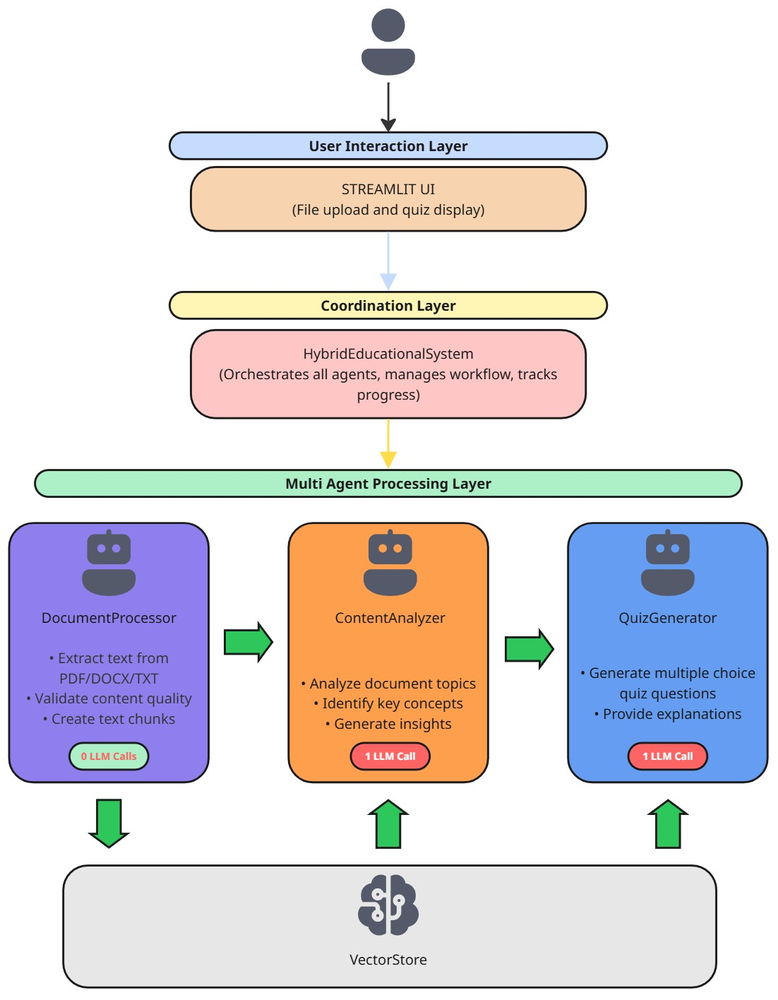

#  🎓 AI Quiz Generator

A multi-agent AI system that transforms educational documents into interactive quizzes in seconds. This application demonstrates cost-efficient AI orchestration - using only 2 LLM calls to process any document and generate personalized quiz questions with explanations.
Features

## 🚀 Features
- Multi-Agent Architecture: 3 specialized agents working in coordination for maximum efficiency
- Document Processing: Extract text from PDF, DOCX, and TXT files with quality validation
- Content Analysis: AI-powered topic identification and complexity assessment
- Quiz Generation: Create multiple-choice questions with detailed explanations
- Interactive UI: Beautiful Streamlit interface with real-time agent status updates
- Cost Tracking: Monitor LLM usage and costs in real-time (~$0.004 per quiz)
- Instant Feedback: Take quizzes with immediate correct/incorrect responses
- Public Sharing: Deploy via Google Colab with ngrok for global access

## Quick Start
1. Open Google Colab: colab.research.google.com
2. Setup API Keys:
    - Click the 🔑 key icon in Colab's left sidebar
    - Add secrets:
        - OPENAI_API_KEY: Your OpenAI API key (get from platform.openai.com)
        - NGROK_TOKEN: Your ngrok token (get from ngrok.com)
    - Enable "Notebook access" for both secrets

## 🏗️ System Architecture


## 🛠️ Installation

### Dependencies
```python
pip install streamlit>=1.28.0
pip install openai>=1.0.0
pip install pydantic>=2.0.0
pip install faiss-cpu>=1.7.0
pip install langchain>=0.1.0
pip install langchain-openai>=0.1.0
pip install PyPDF2>=3.0.0
pip install python-docx>=0.8.11
pip install pyngrok>=6.0.0  
```

## 📖 Usage
1. Upload Document: Support for PDF, DOCX, and TXT files
2. Select Parameters: Choose number of questions (3-10)
3. Generate Quiz: Watch the multi-agent system work in real-time
4. Take Quiz: Interactive questions with instant feedback
5. Review Performance: See detailed metrics and results

## 📈 Project Stats
- 📊 Efficiency:    2 LLM calls per quiz (vs. traditional 10-20)0
- 💰 Cost:          ~$0.004 per quiz (vs. $50-200 traditional tools)
- ⏱️ Speed:         10 seconds (vs. 2-4 hours manual creation)
- 🎯 Accuracy:      High-quality educational questions
- 📱 Compatibility: Works on desktop, tablet, and mobile
- 🌍 Access:        Global via ngrok tunnel sharing

## Demo
<video controls src="Video Presentation.mp4" title="Title"></video>